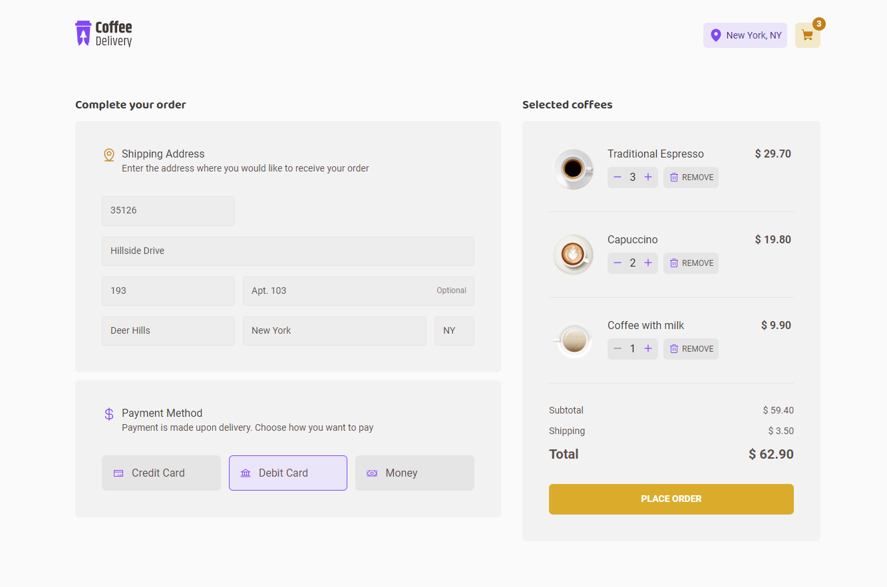
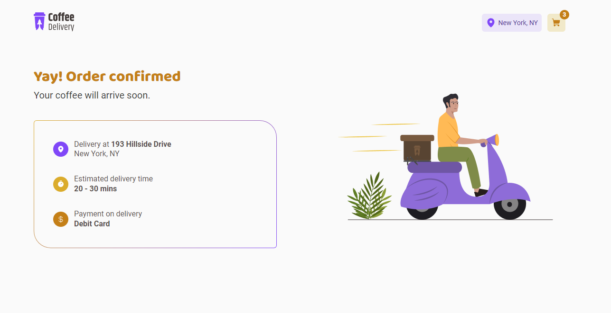

<h1 align="center">
   
  
    
  

    
    
    
  

</h1>

## ✨ Description

This app simulates a coffee shop delivery from the products list to the checkout and success pages. 
Developed as a challenge during the "Ignite - ReactJS" bootcamp by [@Rocketseat](https://www.rocketseat.com.br).

## 🚀 Technologies
-  React
    -  States, hooks, routes, props
    -  Context API
    -  Custom reducers
-  TypeScript
-  ViteJS
-  Styled-Components
-  React Hook Form + Zod
-  Map, filter and reduce functions
-  Toast notifications

## 💻 Installation

After cloning/downloading this repository, open your terminal, navigate to the project's directory then run:

-  `npm install` - To install packages dependencies
-  `npm run dev` - To run the application on your localhost

## 🌟 Preview

